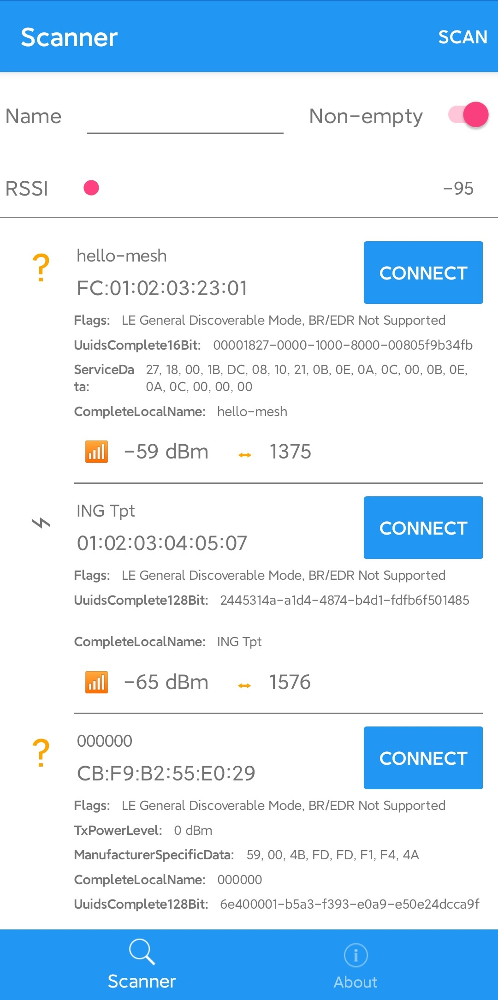
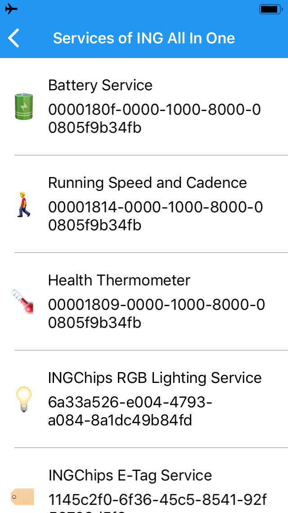
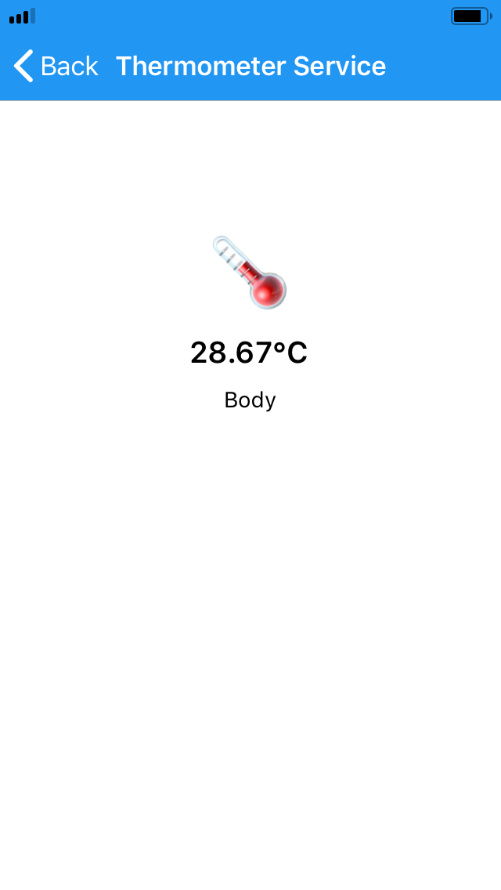
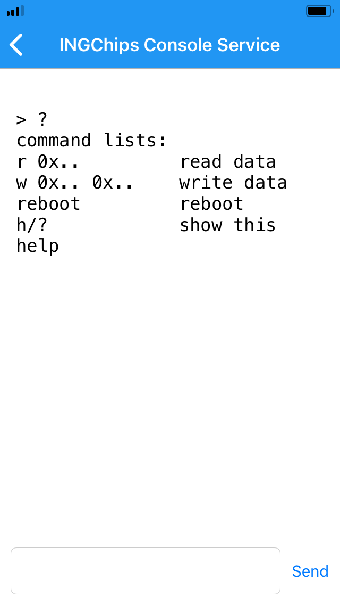

# INGdemo

A crossplatform app demostrating BLE services.

 

 

## Build

Use Visual Studio 2017/2019 to open the solution and build it.

Note: `secrets.json` under the shared project is used to contain secrets, Web API keys, etc.
Currently this app uses Tecent/Google API for speech recognization. To build this app, 
install Mobile.BuildTools and create one like this (keys are optional for building):

```javascript
{
  "TecentAiPlatformSecrets_app_key": "...",
  "TecentAiPlatformSecrets_app_id": "...",
  "Google_app_key": "..."
}
```
